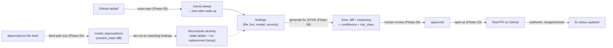
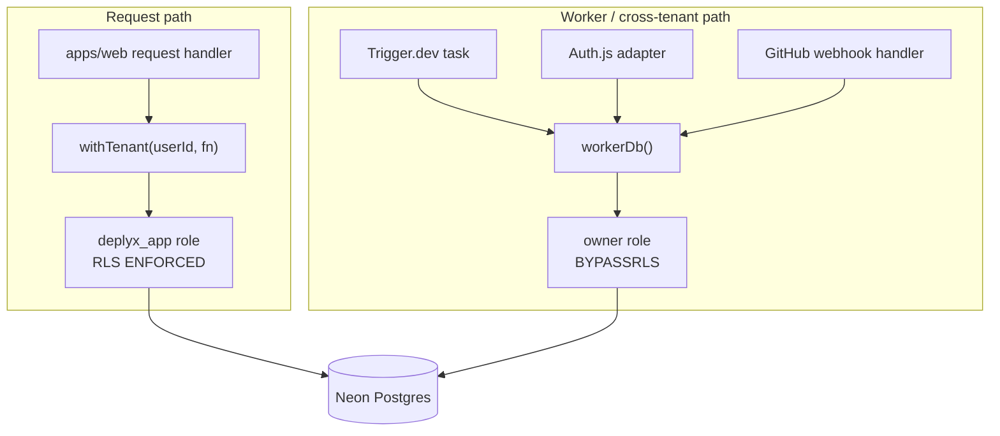

# Deplyx

**Your repos still call `gpt-4-32k`. Deplyx notices before your users do.**

GitHub-integrated dashboard that watches connected repos for hard-coded references to
deprecated/discontinued AI models, scores the blast radius, generates a reviewable fix PR with an
LLM using *your own* API key, and tracks it through merge — automatically, the day a provider
announces a shutdown.

> **Status:** Phase 03 (Auth.js + GitHub App) is code-complete; live acceptance against real
> credentials is next. Milestone 1 (a working read-only dashboard end to end) is Phase 06. See
> [`PROJECT_STATUS.md`](PROJECT_STATUS.md) for the one-glance current state.

`Next 16` · `React 19` · `TypeScript 5.9.3` · `Drizzle + Neon Postgres (RLS)` · `Auth.js v5` ·
`Octokit` · `Trigger.dev v4` · `Upstash Redis` · `web-tree-sitter` · `Vercel AI SDK 7` ·
`Biome 2.5` · `Turborepo + pnpm`

---

## What it does

AI providers deprecate and shut down models constantly — often on a few months' notice, in a blog
post nobody on your team read. If a model ID is hard-coded in a repo, it silently starts 404ing
(or worse, silently degrading) the day the provider flips the switch. Nobody finds out until
production breaks.

Deplyx closes that loop:

1. **Watches** a live feed of AI model deprecations (`deprecations.info`) on a schedule, not on
   your memory.
2. **Knows** which of your connected repos reference an affected model — it already scanned them.
3. **Scores** severity from real dates (announcement → deprecation → shutdown) and whether a
   replacement exists yet.
4. **Generates** a real diff using an LLM (your own BYOK key — Anthropic, OpenAI, Groq, or Google),
   swapping the model ID and fixing any related param/SDK-shape breakage, not just a string
   replace.
5. **Opens a PR** you review like any other, authored by the Deplyx GitHub App, tracked back to
   merge/close via webhook — no polling.

The demo moment is step 2: the day a provider deprecates a model, Deplyx already knows which of
your repos are affected, before you'd have found out yourself.

## How it works



| Stage | What happens | Ships in |
|---|---|---|
| Feed poll | Fetch + cache the deprecation feed, upsert `model_deprecations`, detect real changes via `content_hash` | Phase 04 |
| Fan-out | Recompute severity for every existing finding whose model just changed status | Phase 04 |
| Scan | Stream a repo's tarball (never buffered whole), cheap literal string sweep first, tree-sitter parse (walk up to the enclosing function) only on files with a hit | Phase 05 |
| Findings | Upserted per `(repo, file, line, matched_value, kind)`; untouched-on-rescan findings are soft-resolved, never deleted | Phase 05 |
| Fix generation | LLM call (your BYOK key) over the real enclosing-function context, diff-parsed and lint-gated, scored for confidence and risk class | Phase 08 |
| Review | In-app diff viewer, human approves or rejects | Phase 09 |
| PR | Real branch + commit + PR via the Git trees/blobs API, opened by the Deplyx App identity | Phase 10 |
| Merge tracking | Webhook flips fix status to `merged`/`closed` — no polling | Phase 10 |

## Architecture

```
apps/web            Next.js app (dashboard, auth, GitHub App callback, webhooks) + Trigger.dev tasks
packages/db          Drizzle schema, RLS policies, migrations, typed clients
packages/github      Octokit wrapper: App auth, token minting, repo listing, webhook verification
packages/shared      zod schemas, enums, shared constants, env validation
packages/scanner     ⏳ Phase 05 — tree-sitter parsers, literal matcher, call-site extraction
packages/ai          ⏳ Phase 07/08 — BYOK provider adapter + fix-generation interface
```

`apps/web`, `packages/db`, `packages/shared`, and `packages/github` are real, working code today.
`packages/scanner` and `packages/ai` are planned package boundaries — frozen in the roadmap so
later phases drop in cleanly, but nothing lives there yet.

### The trust boundary

Every tenant table carries `user_id` directly — no FK-chain walks to figure out ownership. RLS is
**fail-closed**:

```sql
user_id = nullif(current_setting('app.user_id', true), '')::uuid
```

An unscoped connection matches zero rows. Never a cross-tenant leak, never a 500 — just an empty
result. Every tenant table also runs `FORCE ROW LEVEL SECURITY`, not just `ENABLE`, which binds the
table owner too (Neon's `neondb_owner` has `BYPASSRLS`, confirmed live, which is exactly why the
two client paths below must never cross).



Two clients, two purposes, never crossed:

- **`withTenant(userId, fn)`** (`packages/db`) — the *only* way to get a scoped query handle for
  the request path. Opens a transaction, `SET LOCAL app.user_id`, runs `fn`. Returns a branded type
  nothing else can construct.
- **`workerDb()`** (`@deplyx/db/worker`) — a separate, Biome-import-restricted entrypoint, allowed
  from exactly three call sites: Trigger.dev tasks (cross-tenant fan-out is the job), Auth.js's
  adapter (its tables have zero grants to `deplyx_app`, and `users` needs a bypass at
  account-creation time — there's no `app.user_id` to scope by yet), and the GitHub webhook route
  (GitHub calls in with no Deplyx session; it resolves the owning `user_id` first, then opens a
  scoped transaction for the actual write). A fourth call site is a decision to raise, not a lint
  rule to quietly route around.

`fixes.status` has exactly one writer: `transitionFix(db, fixId, from, to)`, a conditional
`UPDATE ... WHERE status = from` that throws on 0 rows affected — no other code hand-rolls that
update. Findings are soft-resolved (`resolved_at`), never deleted, on re-scan.

## Tech stack

| Layer | Choice | Why (short version) |
|---|---|---|
| Framework | Next.js 16.2.11, React 19.2.8 | latest-everything policy (D5) |
| Language | TypeScript **5.9.3**, pinned exact | 7.0.2 drops the classic `typescript/lib/typescript.js` compiler-API entrypoint (Go-native rewrite) that Next.js/drizzle-kit/vitest need — confirmed by direct inspection, not assumed |
| DB / ORM | Neon Postgres, Drizzle 0.45.2 | serverless Postgres + real RLS, not app-level tenant filtering |
| Auth | Auth.js v5 beta (`next-auth@5.0.0-beta.32`) | GitHub OAuth login, `DrizzleAdapter` |
| GitHub | `@octokit/app` 16.1.2 + `@octokit/rest` 22.0.1 | App auth composed with typed REST + pagination |
| Background jobs | Trigger.dev v4 (`4.5.7`) | durable cron + fan-out tasks, isolated from the Next.js runtime |
| Cache / rate limit | Upstash Redis (`@upstash/redis` 1.38.0, `@upstash/ratelimit` 2.0.8) | two-tier feed cache, per-repo scan rate limiting |
| Parsing | `web-tree-sitter` 0.26.11 | WASM grammars, no native node-gyp bindings (D9) |
| AI | Vercel AI SDK 7 (`ai` 7.0.37) + `@ai-sdk/openai`, `@ai-sdk/anthropic` | provider-agnostic BYOK fix generation |
| Styling | Tailwind CSS 4.3.3 | |
| Lint/format | Biome 2.5.5 | one root config, not ESLint + Prettier (user-directed) |
| Test | Vitest 4.1.10 | |
| Monorepo | Turborepo 2.10.6 + pnpm 11.17.0, exact-pinned `catalog:` | reproducible builds across packages |

Every shared dependency above is pinned exact in `pnpm-workspace.yaml`'s `catalog:` block — see
that file for the full, current list (this table is a curated subset, not exhaustive).

## Getting started

### Prerequisites

- Node.js ≥ 22
- `corepack enable` then `corepack prepare pnpm@11.17.0 --activate` (or `npm install -g pnpm@11.17.0`)
- A [Neon](https://neon.tech) Postgres project

### 1. Install

```bash
pnpm install
```

No `.env` is required yet just to boot the placeholder/landing page — env validation
(`packages/shared/src/env.ts`) is lazy: it's enforced the moment code actually needs a given
variable, not at import time.

### 2. Environment variables

Copy `.env.example` to `.env` and fill in as you go — you don't need every value on day one, only
the ones for the phase you're running. **Never delete or recreate this file once it holds real
values** — it's gitignored on purpose.

| Variable | Purpose | Needed from |
|---|---|---|
| `DATABASE_URL` | Owner/superuser connection string. Used **only** by `pnpm db:role` and `pnpm db:migrate` — never by the running app, since the owner role bypasses RLS entirely | Phase 02 |
| `APP_DATABASE_URL` | `deplyx_app` role connection string — RLS **enforced**. Every request-path query goes through this, via `withTenant()` | Phase 02 |
| `WORKER_DATABASE_URL` | Privileged role connection string — RLS **bypassed**. Used only by `workerDb()`'s three vetted call sites. Same credential as `DATABASE_URL` today, kept as a separate var so the roles can split further later without touching call sites | Phase 02 |
| `APP_DB_PASSWORD` | Password `pnpm db:role` uses when first creating `deplyx_app` | Phase 02 |
| `UPSTASH_REDIS_REST_URL` / `UPSTASH_REDIS_REST_TOKEN` | Feed cache + scan rate limiting | ⏳ Phase 04 |
| `TRIGGER_SECRET_KEY` / `TRIGGER_PROJECT_ID` | Trigger.dev project auth | ⏳ Phase 04 |
| `AUTH_SECRET` / `AUTH_URL` | Auth.js session signing + canonical URL | Phase 03 |
| `AUTH_GITHUB_ID` / `AUTH_GITHUB_SECRET` | GitHub **OAuth App** (login identity) | Phase 03 |
| `GITHUB_APP_ID` / `GITHUB_APP_SLUG` / `GITHUB_APP_PRIVATE_KEY` / `GITHUB_APP_WEBHOOK_SECRET` | GitHub **App** (repo install, PR authoring, webhooks — a separate identity from the OAuth App) | Phase 03 |
| `ENCRYPTION_MASTER_KEY` | AES-256-GCM master key for encrypting BYOK provider keys at rest (32 raw bytes, base64) | ⏳ Phase 07 |
| `NODE_ENV` | standard | — |

### 3. Database

```bash
pnpm db:role      # idempotent — creates/rotates the deplyx_app role. MUST run before db:migrate:
                  # the migration's GRANT/CREATE POLICY statements reference deplyx_app already existing.
pnpm db:migrate   # runs against Neon's direct endpoint, not the pooler
pnpm db:seed
```

### 4. GitHub OAuth App (user login)

Separate identity from the GitHub App below — this one is just for signing in.

- GitHub → Settings → Developer settings → OAuth Apps → New OAuth App.
- Homepage URL: `http://localhost:3000`. Authorization callback URL:
  `http://localhost:3000/api/auth/callback/github`.
- Set `AUTH_GITHUB_ID` / `AUTH_GITHUB_SECRET` from the generated client ID/secret.
- Generate `AUTH_SECRET` with `npx auth secret` (or `openssl rand -base64 32`). Set
  `AUTH_URL=http://localhost:3000`.

### 5. GitHub App (repo install, PR authoring, webhooks)

Separate identity from the OAuth App above.

- GitHub → Settings → Developer settings → GitHub Apps → New GitHub App.
- Homepage URL: anything (e.g. `http://localhost:3000`).
- Callback URL: `http://localhost:3000/api/github/callback`. Check "Request user authorization
  (OAuth) during installation" **off** — this App's callback is for install redirects, not login.
- Webhook URL: `http://localhost:3000/api/github/webhooks` (needs a public tunnel — e.g.
  `ngrok http 3000` — to actually receive events locally; GitHub can't reach `localhost` directly).
  Webhook secret: generate one and set it as `GITHUB_APP_WEBHOOK_SECRET`.
- Permissions: **Contents** — Read & write. **Pull requests** — Read & write. **Metadata** —
  Read-only.
- Subscribe to events: **Installation**, **Installation repositories**.
- After creating: note the App ID (`GITHUB_APP_ID`) and slug (`GITHUB_APP_SLUG`, from the App's
  URL). Generate a private key (Settings → General → Private keys) and set
  `GITHUB_APP_PRIVATE_KEY` to its full PEM contents (keep the `\n` line breaks — see
  `.env.example`'s format).

### 6. Trigger.dev ⏳ *Phase 04 — not wired yet*

`trigger.config.ts` and the task files under `apps/web/src/trigger/**` don't exist yet. Once they
do: create a project at [trigger.dev](https://trigger.dev), set `TRIGGER_SECRET_KEY` /
`TRIGGER_PROJECT_ID`, run `pnpm trigger:dev`.

### 7. Upstash Redis ⏳ *Phase 04 — not wired yet*

Create a free [Upstash](https://upstash.com) Redis database, set `UPSTASH_REDIS_REST_URL` /
`UPSTASH_REDIS_REST_TOKEN`. Backs the two-tier feed cache and per-repo scan rate limiting.

### 8. BYOK provider key encryption ⏳ *Phase 07 — not wired yet*

`packages/shared/src/crypto.ts` doesn't exist yet. Once it does: generate a key with
`openssl rand -base64 32` and set `ENCRYPTION_MASTER_KEY`. The `provider_keys` table and its
`bytea` column already exist (Phase 02); no encryption runs against it yet.

### 9. Run it

```bash
pnpm dev
```

Sign in at `/login`, then use the "Install the GitHub App" link on `/dashboard` to connect a test
repo.

## Commands

```bash
pnpm install
pnpm dev             # boots apps/web
pnpm lint            # biome check, workspace-wide
pnpm lint:fix        # biome check --write
pnpm typecheck       # turbo run typecheck
pnpm test            # vitest workspace; packages/db's RLS suite is env-gated — skips cleanly without DATABASE_URL
pnpm format          # biome format --write
pnpm format:check    # biome format (check only)
pnpm build           # turbo run build
pnpm trigger:dev     # ⏳ Phase 04 — starts the Trigger.dev dev CLI
pnpm db:generate     # drizzle-kit generate, scoped to @deplyx/db
pnpm db:role         # idempotent — create/rotate the deplyx_app Postgres role (run before db:migrate)
pnpm db:migrate      # run against Neon's direct endpoint, not the pooler
pnpm db:seed
```

## Project status & roadmap

| # | Phase | Status |
|---|---|---|
| 01 | Monorepo + tooling | ✅ done |
| 02 | DB schema + RLS | ✅ done |
| 03 | Auth.js + GitHub App | 🟡 code complete, live acceptance pending |
| 04 | Trigger.dev + feed-poll | ⬜ not started |
| 05 | Scanner + findings | ⬜ not started |
| 06 | Read-only dashboard — **Milestone 1** | ⬜ not started |
| 07 | BYOK provider keys | ⬜ not started |
| 08 | LLM fix generation | ⬜ not started |
| 09 | Diff review UI | ⬜ not started |
| 10 | PR creation | ⬜ not started |
| 11 | Package detector | ⬜ not started |
| 12 | Auto-merge + deploy hardening | ⬜ not started |

Live, detailed status: [`PROJECT_STATUS.md`](PROJECT_STATUS.md). Full plan, acceptance criteria,
and per-phase decision logs: [`docs/plans/00-ROADMAP.md`](docs/plans/00-ROADMAP.md).

## Design decisions worth knowing

Full list (12 frozen decisions + 17 non-obvious architecture calls) in
[`docs/plans/00-ROADMAP.md`](docs/plans/00-ROADMAP.md). The highest-leverage ones:

- **RLS is fail-closed and forced**, not just enabled — an unscoped connection reads/writes zero
  rows, never a leak. See [the trust boundary](#the-trust-boundary) above.
- **Tenant key is `users.id`**, carried directly on every tenant table — no FK-chain walks to
  determine ownership.
- **Installation tokens are never persisted** — minted on demand, held in memory only within one
  worker run.
- **Two-pass scanning**: a cheap literal string sweep runs first; tree-sitter only parses files
  that actually contain a hit, and walks up to the enclosing function rather than taking a naive
  line window.
- **Findings are soft-resolved** (`resolved_at`), never deleted, on re-scan.
- **`transitionFix()` is the only writer for `fixes.status`** — a conditional
  `UPDATE ... WHERE status = from`, throws on 0 rows affected.
- **Provider keys**: AES-256-GCM, per-record IV+tag in one `bytea`; never selected on the request
  path, decrypted only just-in-time inside a worker.
- **Biome, not ESLint/Prettier** — one root config; the worker-client and Trigger-task import
  boundaries above are enforced by Biome's `noRestrictedImports`, not a convention people have to
  remember.
- **Every shared dependency pinned exact** in the root `catalog:` block — reproducible builds,
  no silent minor-version drift.

## Contributing / conventions

- Small, conventional commits.
- `pnpm lint && pnpm typecheck && pnpm test` green before flipping any phase to done.
- End of each phase: tick its checkboxes, append a `## Decisions made` entry in that phase's file,
  flip its `Status:` line, update the table in `PROJECT_STATUS.md` and `docs/plans/00-ROADMAP.md`,
  commit.
- Anything that contradicts a frozen decision gets raised in the current phase file's Notes
  section, not silently absorbed.
- Don't create or delete the root `.env` file — it's gitignored and holds live credentials. Edit
  it in place if a fix is needed.

## Docs map

- [`PROJECT_STATUS.md`](PROJECT_STATUS.md) — one-glance current state, check this first every session.
- [`CLAUDE.md`](CLAUDE.md) — agent-oriented architecture summary and conventions.
- [`docs/plans/00-ROADMAP.md`](docs/plans/00-ROADMAP.md) — full 12-phase plan, frozen decisions.
- `docs/plans/0N-*.md` — per-phase spec, tasks, acceptance criteria, decision log.
